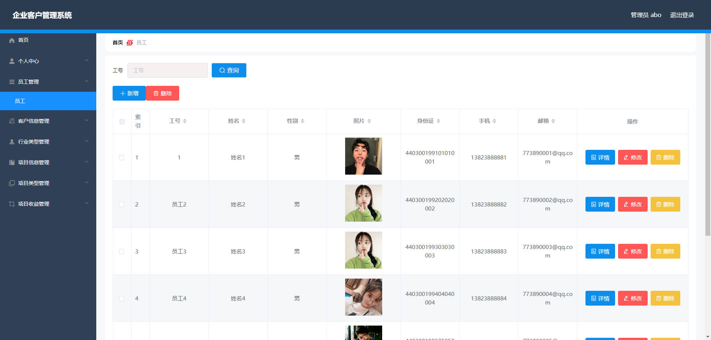
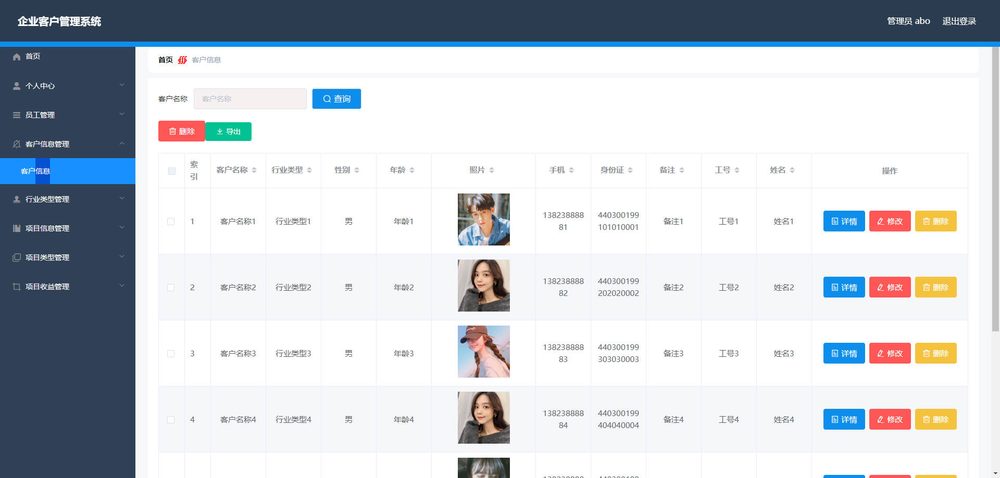
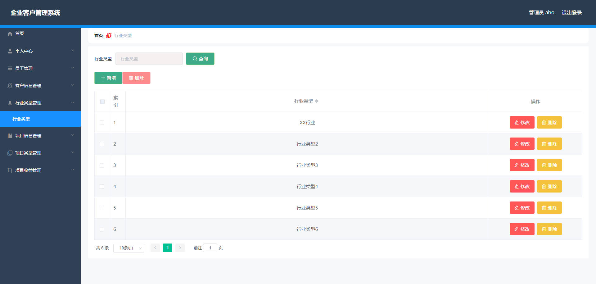
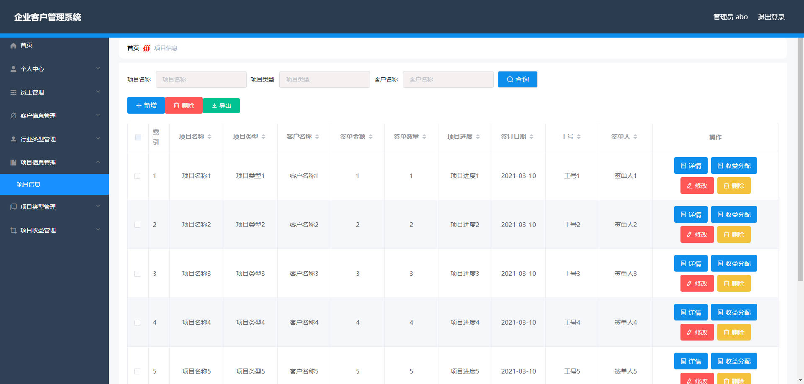
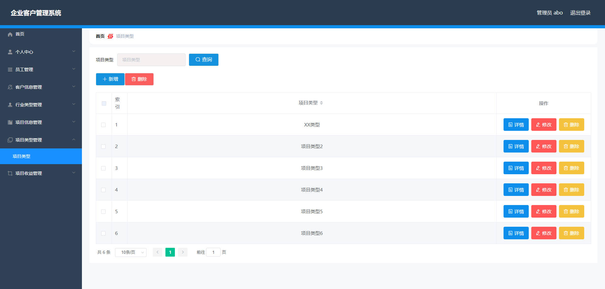
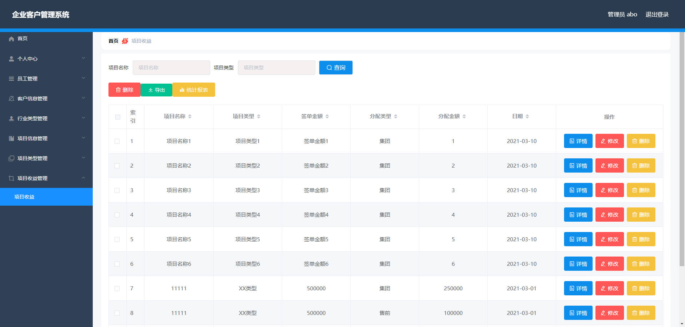
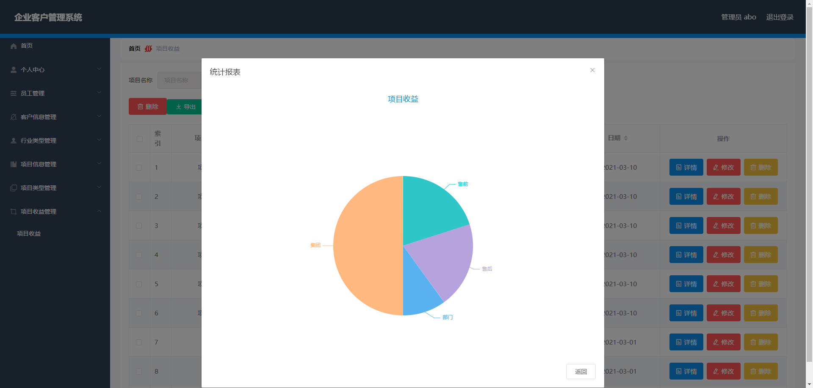
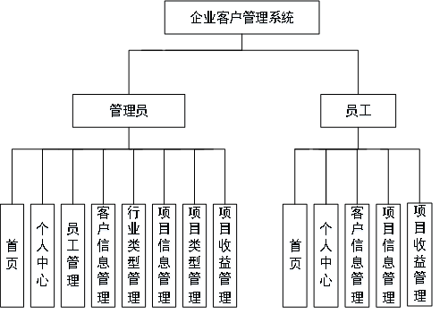
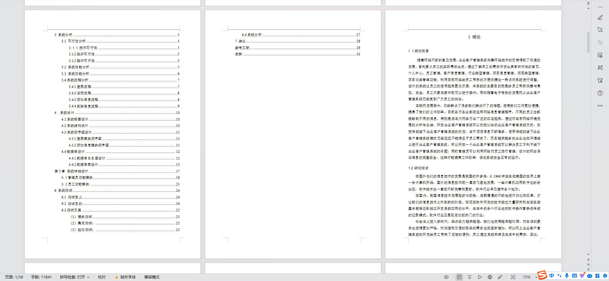

# 基于Springboot的企业客户管理系统

## Springboot-0024


## 技术栈

Springboot mybatisplus vue mysql maven


## 数据库表(9张)


## 功能介绍

```properties
管理员：首页、个人中心、员工管理、客户信息管理、行业类型管理、项目信息管理、项目类型管理、项目收益管理，
员工：首页、个人中心、客户信息管理、项目信息管理、项目收益管理等功能。
```


## 图片

### 前台

### 后台







## 访问路径

### 前台

```properties

```

### 后台

```properties
http://localhost:8080/springboot03445/admin/dist/index.html#/login

账号 abo
密码 abo
```


## 功能图




## 文档目录




## 打赏或交流


